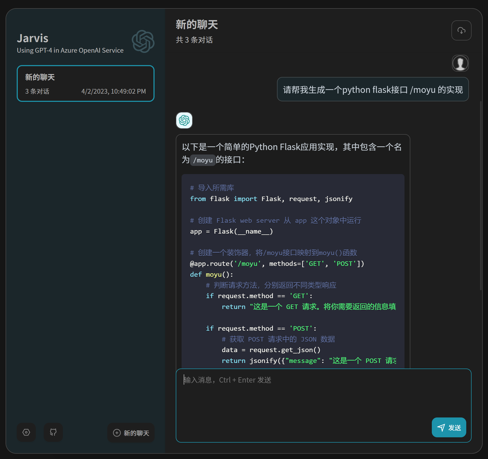
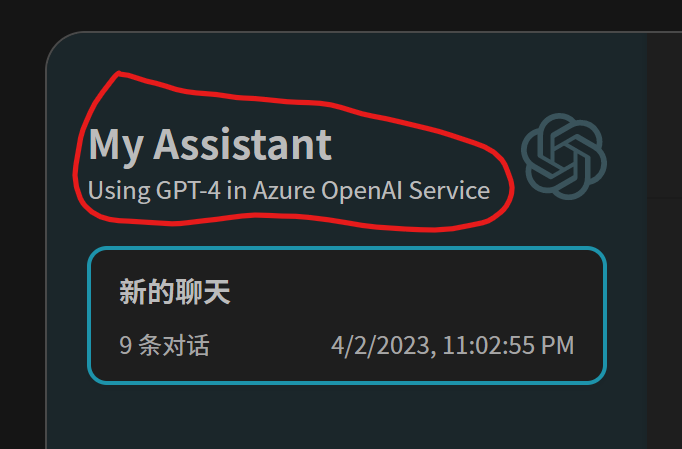
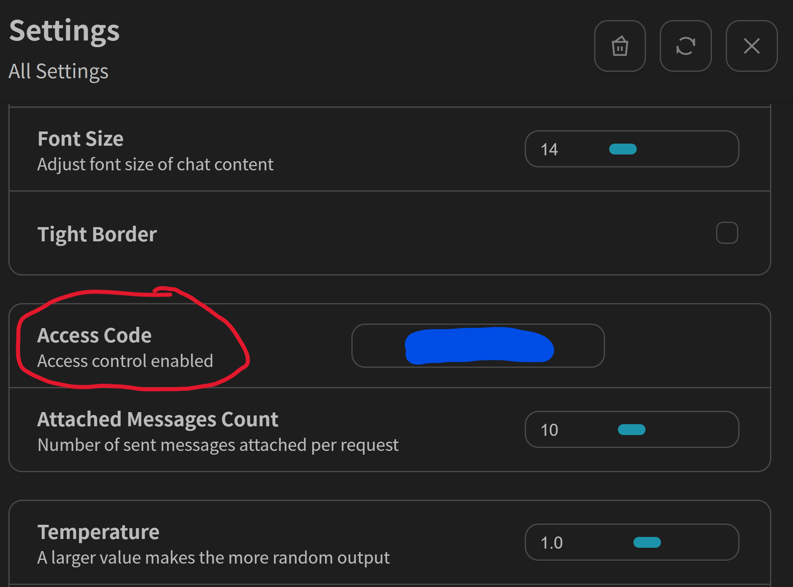

<h1 align="center">Azure ChatGPT Web UI</h1>

Deploy Chatbot Application using GPT4 in Azure Open AI Service

## Feature

- Support Azure Open AI Service GPT-4 & GPT-3.5-Turbo Models
- Responsive UI design and dark mode, with Chinese and English languages support
- Export chat history with full Markdown support

## Roadmap
- [ - ] System Role/Message for initial instructions for models

## Get Started
### Environment Variables

Need to prepare following environment variables. Suggest to use Azure Portal to retrieve related information.

- AZURE_OPENAI_API_BASE

   Endpoint to access Azure Open AI Service.

- OPENAI_API_KEY

   Key to access Azure Open AI Service.

- AZURE_OPENAI_DEPLOYMENT_NAME

   Model deployment name

- NEXT_PUBLIC_TITLE (optional)

Title in the chat window

- NEXT_PUBLIC_SUB_TITLE (optional)

Subtitle in the chat window

- CODE (optional)

Access code to protect the connection to Azure OpenAI Service. If this environment variable is set during deployment, the correct access code should be filled int the setting window:

- NEXT_PUBLIC_SYSTEM_PROMPT (optional)

Set up System Prompt for all conversations.

### Local Development 

1. Install latest nodejs and yarn.
2. Install required package: `yarn install`
3. Run development environment
   - create a new file named `.env.local` in the project root directory to define necessary environment variables
   - start developing: `yarn dev`

### Deployment
Build and run: `yarn build && yarn start`

## Credits
This repo is forked from https://github.com/Yidadaa/ChatGPT-Next-Web and ported to connect to Azure Open AI Service.